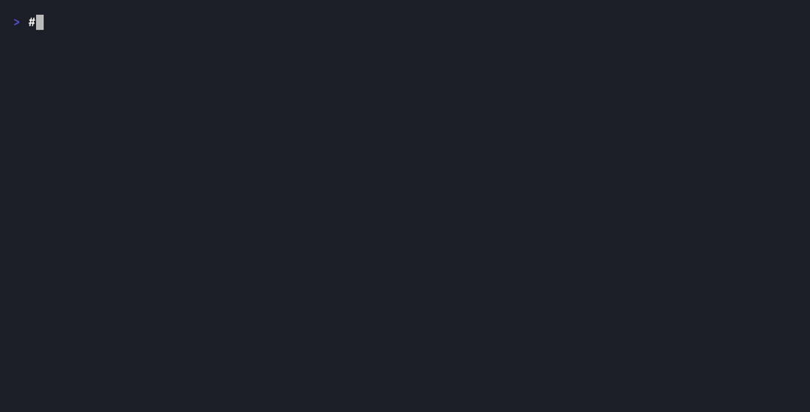

# layoutlint

Your coding agent writes UI it can never see. layoutlint is its eyes:
**layout checks and screenshots in milliseconds — no browser.**



It computes the real layout — same flexbox resolution as CSS, same text
shaper as Chrome, real font metrics — instead of launching a browser. Then
it either **asserts** (overflow, overlap, viewport fit, truncation) or
**paints** what it computed.

Verified, not approximate: **297/297 layout cases match headless Chromium
within 1px** (most at 0.00px), and every render is **pixel-diffed against a
Chromium screenshot**, gated in CI on every push.

## Check

```sh
npx layoutlint check Card.tsx --viewports 320,375,768,1440
```

```
Card.tsx
  ✗ 320px — 1 violation(s)
      fits-viewport div.flex.w-96
        right edge at 384px exceeds the 320px viewport by 64px — causes horizontal scroll
        fix: replace fixed widths with max-w-full / w-full, or add flex-wrap so content can reflow
  ✓ 768px
  ✓ 1440px
```

Every violation answers *what, where, by how much, and a plausible fix* —
shaped for an agent to self-correct. `--json` for machines; exit `1` on
violations. Rules: `no-overflow`, `no-overlap`, `fits-viewport`,
`no-text-truncation`. A 4-viewport check runs in ~8ms.

## Render

```sh
npx layoutlint render Card.tsx --viewport 375 -o card.png   # or .svg
```


That image came from the engine, not Chrome: real Tailwind v4 colors
(extracted from Chrome itself), text as glyph outlines from the same shaping
that measured it, borders, radii, clipping. The SVG is self-contained —
renders identically anywhere, no fonts needed.

## For agents

```jsonc
// MCP (e.g. Claude Code .mcp.json) — check_layout + render_layout tools
{ "mcpServers": { "layoutlint": { "command": "npx", "args": ["layoutlint-mcp"] } } }
```

```yaml
# GitHub Action — layout-lint changed components on every PR
- uses: saifulapm/layoutlint@v0
```

```ts
// Library
import { check, render } from 'layoutlint';
const report = await check(source, { viewports: [320, 768] });
const { png } = await render(source, { viewport: 375, format: 'png' });
```

## Scope, honestly

Flexbox + Tailwind v4, static JSX/HTML. CSS Grid approximates as a column
(warned). Shadows/gradients/opacity aren't painted yet. Not a browser
replacement for E2E — a deterministic bug-catcher and renderer for the
edit-check-fix loop, with documented
[envelope edges](docs/engineering.md#scope-notes-parser--resolver).

## How it's validated

A 297-case corpus (hand-written + real Tailwind markup + seeded fuzzing) is
rendered in pinned headless Chromium; the engine must match every
`getBoundingClientRect` within 1px and every screenshot within a documented
pixel-diff budget — on every push. Scoreboards:
[accuracy](accuracy/README.md) · [paint](paint-accuracy/README.md) ·
methodology and parity lessons: [docs/engineering.md](docs/engineering.md).

MIT
